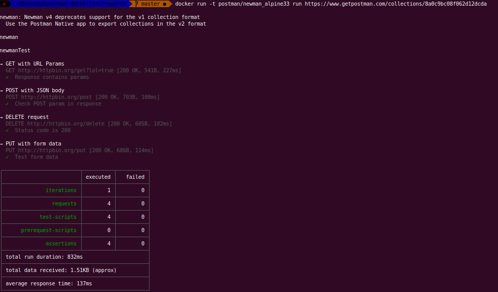
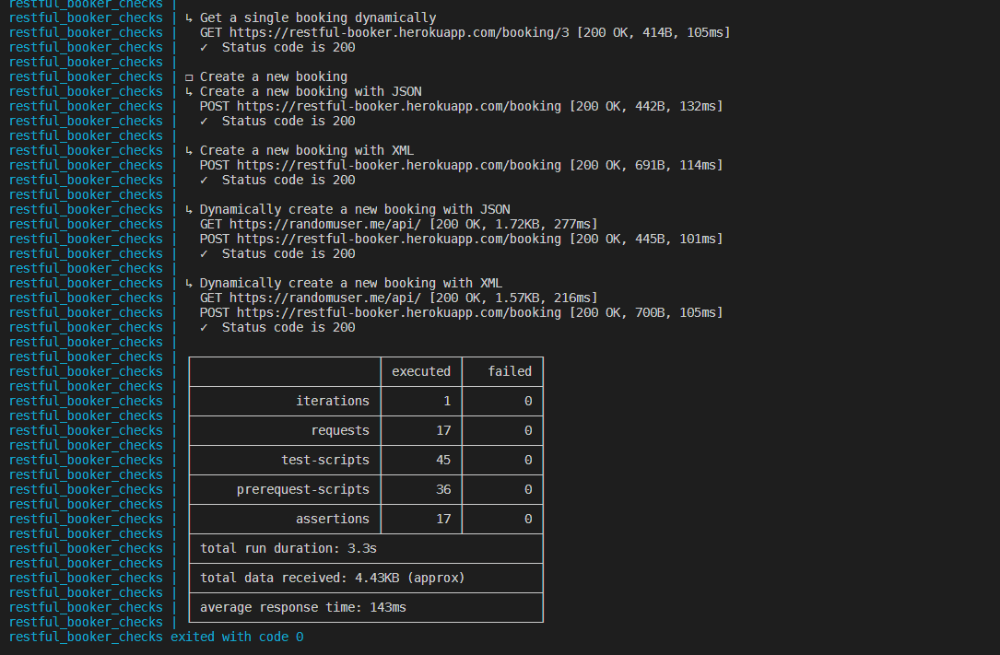
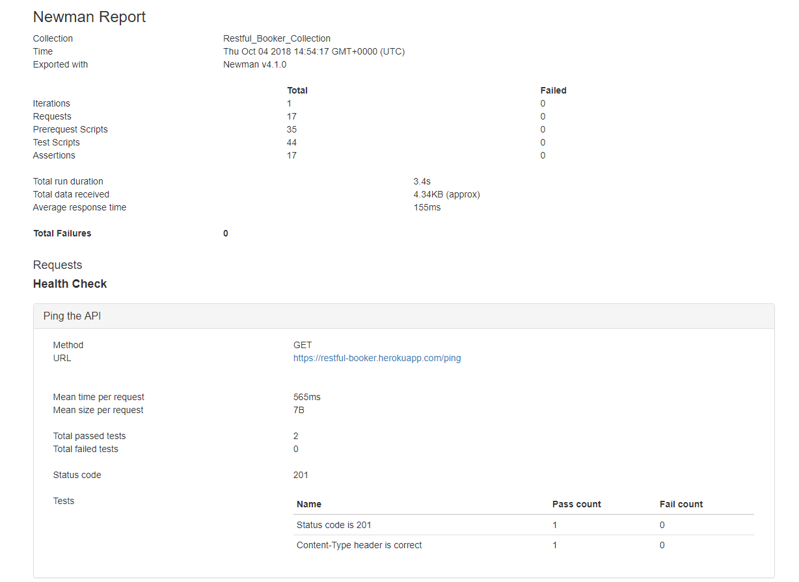
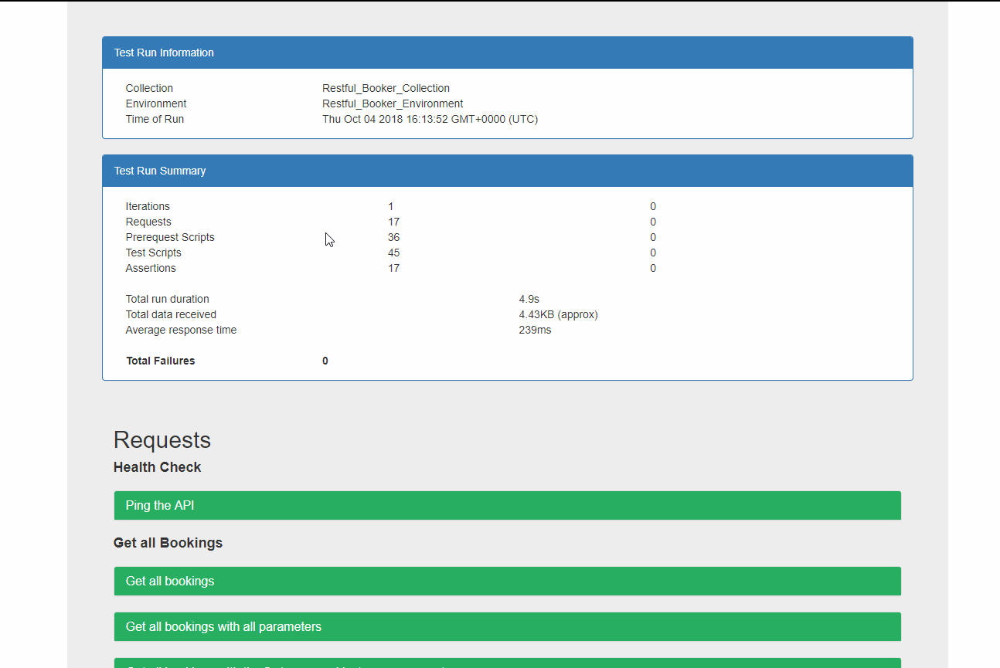
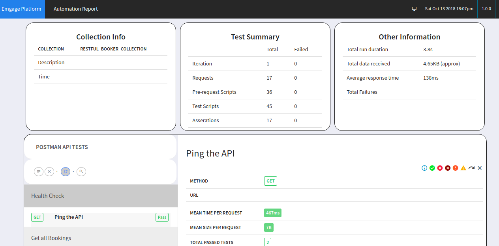
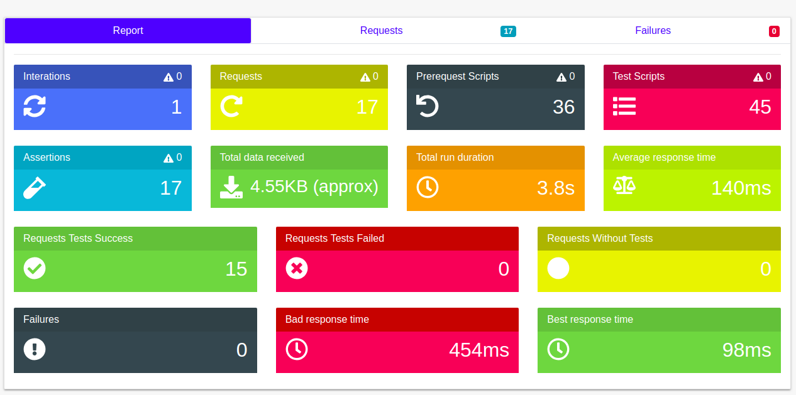
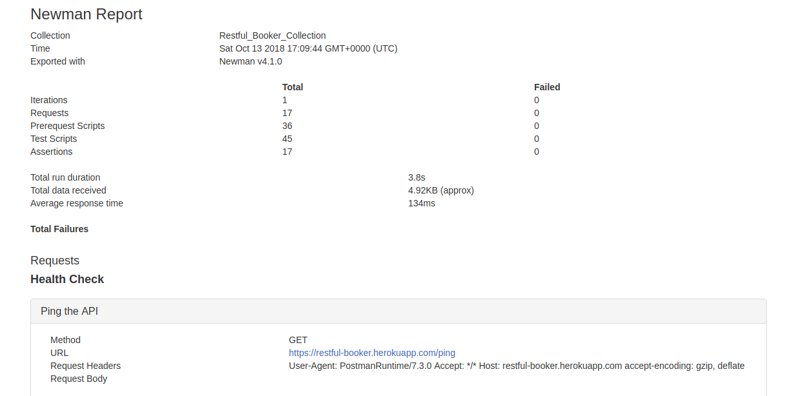

# Run Postman Collections Using Docker

[Postman](https://www.getpostman.com/) is awesome, building and running your checks through the built-in collection runner is amazing but what I like to do, once I have a stable set of requests, is to export my Collection and Environment files from the application and run them in the command line using [Newman](https://github.com/postmanlabs/newman).

I have [nodejs](https://nodejs.org/en/) installed on my local machine so it's easy for me to globally install `newman` and crack on with running the checks but some folks won't have this and probably don't want to install `nodejs` on their machine.

This is where using Docker comes in handy, you can use pre-defined Images that contain everything you need to run the checks, without the need to install lots of different dependencies onto your local machines. Docker is by no means a new technology but it is _newish_ to me so I'm kind of 'learning by doing' and creating something that works but can be updated once my own Docker knowledge increases, you have to start somewhere :).

I've created an example based repository for anyone to get an idea of how to start using your Postman Collections, created in the within the application and run these using a Docker Image.

---

Postman has it's own official [Docker Image](https://hub.docker.com/r/postman/newman_alpine33/) on Dockerhub with instructions to get you set up and started. It's really _simple_ to get your Postman collections running with the image, straight from the command line.

This is an example taken from Dockerhub using the `postman/newman_alpine33` image:

```bash
docker run -t postman/newman_alpine33 run https://www.getpostman.com/collections/8a0c9bc08f062d12dcda
```

This command will run a basic collection that sends a few requests to [httpbin](http://httpbin.org) and performs some checks. This example is used to show you the collection running using the Docker Image and what the output is in the terminal.



---

### What Have I Done Differently?

I could have used the `postman/newman_alpine33` Image and that would have run my collection fine but I wanted to extend this out slightly and add a custom HTML report which gets created following the collection run. Ooh Fancy...

By wanting to do this, I needed to create my own `Dockerfile`, the `postman/newman_alpine33` base Image `nodejs` and `newman` versions are getting a bit old now and the latest version of the `newman-reporter-html` module requires `newman >= v4.0.0` and `nodejs >= v6.x` - Both of which are not part of the official Image.

My current `Dockerfile` looks like this, I needed `nodejs` so I have used a version (I could just take the latest but I haven't for now) of the `node` base Image and then installed the two modules 'globally' via `npm`. This file also creates a new `WORKDIR` and specifies an `ENTRYPOINT`.  

```bash
FROM node:10.11.0-alpine

RUN npm install -g newman newman-reporter-html

WORKDIR /etc/newman

ENTRYPOINT ["newman"]
```

I also created a `docker-compose.yml` file to help make running the collection easier, like I said before, I'm still learning Docker so this might not be needed but I'm going with it for now. For the example, I'm using a collection and environment file from my other [All-Things-Postman](https://github.com/DannyDainton/All-Things-Postman) repo.

```yml
version: "2"
services:
  postman_checks:
      container_name: restful_booker_checks
      build: .
      image: postman_checks
      command:
        run Restful_Booker_Collection.json
        -e environments/Restful_Booker_Environment.json
        -r html,cli
        --reporter-html-export reports/Restful_Booker_Test_Run.html
        --reporter-html-template reports/templates/customTemplate.hbs
      volumes:
        - ./src:/etc/newman
```

This file contains a few default properties `version` and `services`, these are required to make it a valid `docker-compose` file, I've also then added a service name of `postman_checks`.

As well as these standard file properties, I have some additional ones that are specific to my collection run:

* `container_name` - Gives the new container a friendly name or it will pick up the default random name
* `build` - This is building from the root dir as this is where my `Dockerfile` is located
* `image` - Same reason for using a `container_name`, this just gives the `image` a name
* `command` - This is the important part, it's the command that tells `newman` where your files are located and what output you would like after the collection run
* `volumes` - This is equally import as it provides a link from the local `./src` dir to the `/etc/newman` dir in the container

---

### Collection Run Output On The Command Line

The default output if you're using `newman` locally or using the Docker Image, is on the CLI - This will give you a simple breakdown of what happened during the collection run.



### Collection Run HTML Reports

The whole reason why I'm not using the Official Image is to get a custom HTML report from the collection run - For this I'm using the `newman-html-reporter` module, in order to tell `newman` to use this I've added a couple of arguments to the `command` property in the `docker-compose.yml` file. First, we need to tell it we want to use an additional reporter, this is done using the `-r cli,html` flag. This alone would be enough to create the report and save the to the root directory but I wanted it to be placed in a particular directory. For this I've used the `--reporter-html-export` flag and then specified a filename and a location `reports/Restful_Booker_Test_Run.html`.

After the run, the new HTML report is added to the `.src/reports` directory.



The standard HTML output is fine but it looks a bit _boring_...so I wanted to jazz it up a little bit.

We can do this by telling `newman` to also use a custom HTML template, this can be customised to suit your needs. You can literally [Bootstrap](http://getbootstrap.com/) all the things, if you like! :) The location of the template is referenced using the `--reporter-html-template` flag and then passing this a filename.

I found this custom template from [tegomass](https://gist.github.com/tegomass/fd67fa22f39a7ebe33a533862ff09d88) but I changed a few things, to make it look a bit better....in my opinion. :)



I've added a couple more custom template examples in the `./reports` dir that I've found, which all look slightly different but it's good to know that you could create a really fancy looking one, if you wanted too. :)

* [SandipMehta's repo](https://github.com/SandipMehta/NewMan-HTML-Custom-Report)
* [MarcosEllys' repo](https://github.com/MarcosEllys/awesome-newman-html-template)
* [felixdjost's repo](https://github.com/felixdjost/newman-html-report-template-verbose)

An example of each of the awesome templates from the repo's listed above:

#### Custom Template 1


#### Custom Template 2


#### Custom Template 3


To apply one of the other templates, you just need to change the filename on the `--reporter-html-template` flag, within the `docker-compose.yml`.

---

### Running The Collection

To run this collection from the command line, assuming you have Docker running on your flavour of OS, type the following:

```bash
docker-compose up
```

This _should_ pull the `node` image and install all the components you need, before running through the checks.

Following the collection run, you will still have the `restful_booker_checks` container created, if you wish to removed this, you can use the following command:

```bash
docker-compose rm -f
```
---

That's it really - quite basic but hopefully it makes sense and maybe you can use some of this to create your own Postman Docker collection runs.
